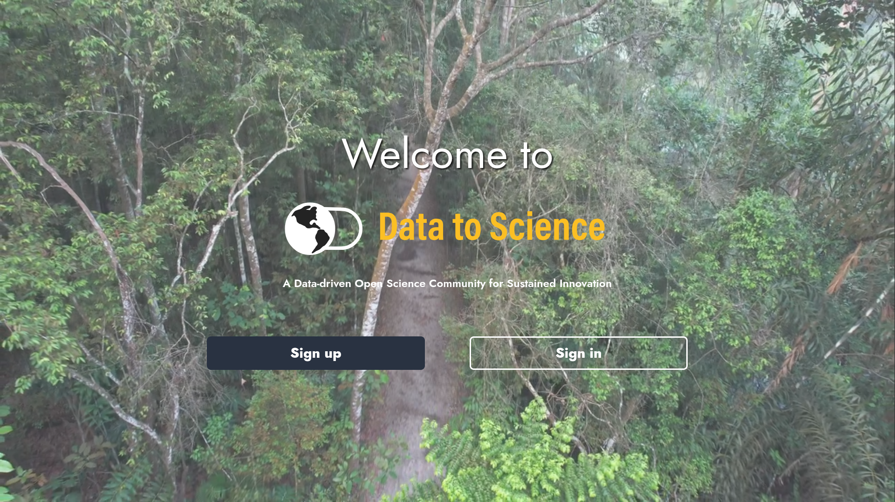
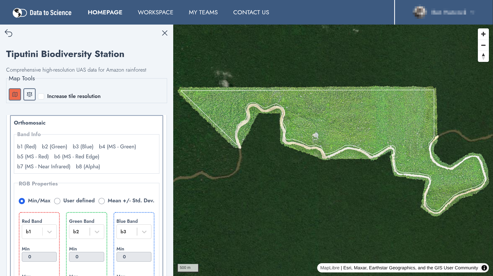
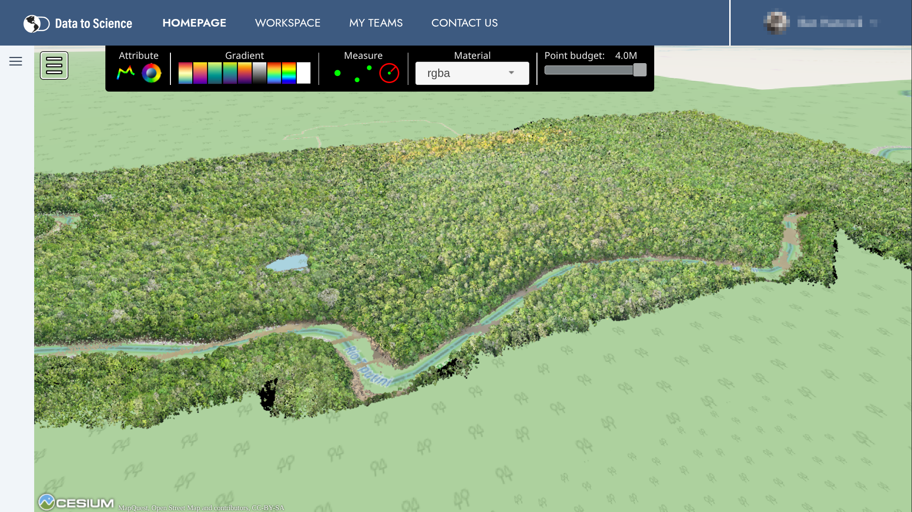
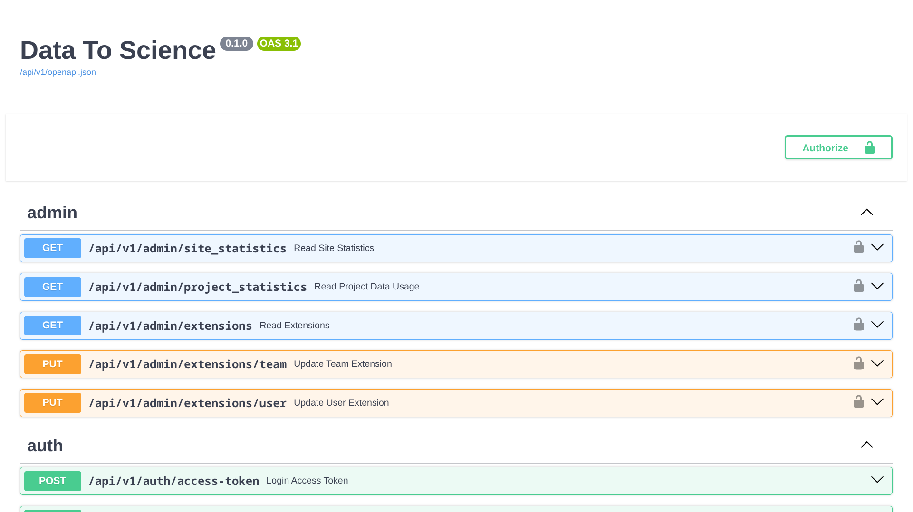

# Data to Science

<p align="center">
  
  
</p>
<p align="center">
  
  
</p>

## What is D2S?

The Data to Science (D2S) platform is an innovative, open-source initiative designed to facilitate data sharing and collaboration among researchers worldwide. Developed by Jinha Jung, an associate professor of civil engineering at Purdue University, and his team, the platform primarily focuses on housing data from unmanned aerial vehicles (UAVs) used in agricultural and forestry research.

D2S aims to create a data-driven open science community that promotes sustained innovation. Researchers can upload, manage, and share their UAV data, making it accessible to a broader audience. This collaborative approach helps in advancing research by providing a centralized repository of valuable datasets from various projects worldwide. The platform is open-source, allowing anyone to deploy it in their own environment, ensuring flexibility and adaptability to different research needs.

## 🌟 What Makes D2S Unique?

The Data to Science (D2S) platform stands out from other data-sharing platforms due to several unique features and approaches:

1. **Specialization in UAV Data:** Unlike many general data-sharing platforms, D2S is specifically designed to manage and share data from unmanned aerial vehicles (UAVs), making it particularly valuable for agricultural and forestry research.
2. **Open-Source and Free Access:** D2S is an open-source platform, ensuring that researchers worldwide can access and contribute to the data repository without any cost barriers.
3. **Focus on Collaboration:** The platform emphasizes building a community of researchers who can collaborate and share insights, fostering a more interactive and cooperative research environment.
4. **Alignment with Open Science Mandates:** D2S aligns with the White House Office of Technology and Policy mandates on openness in scientific enterprise, ensuring that federally funded research and supporting data are disclosed to the public at no cost.
5. **User-Centric Development:** The platform is developed with input from its users, ensuring that the tools and features meet the specific needs of the research community. This user-driven approach helps in creating a more effective and user-friendly platform.
6. **Training and Support:** D2S offers training workshops and support to help researchers get acquainted with the platform's tools and capabilities, ensuring they can make the most of its features.
7. **Self-Deployment Capability:** D2S can be deployed in any environment that supports Docker, providing researchers with the flexibility to integrate the platform into their existing infrastructure. This capability ensures that the platform can be customized and scaled according to specific research requirements.

These aspects make D2S a powerful tool for researchers looking to manage, share, and collaborate on UAV data, particularly in the fields of agriculture and forestry.

## ⚡ Quick Start

### 📋 Prerequisites

[Docker Engine](https://docs.docker.com/engine/install/) and [Docker Compose](https://docs.docker.com/compose/install/) are required to run the container with the following instructions. If you can successfully run `docker --version` and `docker compose --version` from a terminal then you are ready to proceed to the next section.

### Copy env example files

1. Navigate to the root directory of the repository.
2. Copy `backend.example.env` to a new file named `backend.env`.
   ```
   cp backend.example.env backend.env
   ```
3. Copy `db.example.env` to a new file named `db.env`.
   ```
   cp db.example.env db.env
   ```
4. Copy `frontend.example.env` to a new file named `frontend.env`.
   ```
   cp frontend.example.env frontend.env
   ```

### Create tusd-data directory for uploads

1. Create a folder for data to be stored during the upload process.
   ```
   mkdir tusd-data
   ```

### ▶️ Start the containers

1. Use the following command to run the service containers in the background:
   ```
   docker compose -f docker-compose.quickstart.yml up -d
   ```

### ⏹️ Stop the containers

1. Use the following command to stop the containers:
   ```
   docker compose -f docker-compose.quickstart.yml stop
   ```

### 🌍 Accessing the web application

The Data To Science web application can be accessed from `http://localhost:8000`. It may take up to a minute for the backend to finish initializing.

## ⚙️ Getting started with local code

### 📋 Prerequisites

[Docker Engine](https://docs.docker.com/engine/install/) and [Docker Compose](https://docs.docker.com/compose/install/) are required to run the container with the following instructions. If you can successfully run `docker --version` and `docker compose --version` from a terminal then you are ready to proceed to the next section.

### 📝 Copy env example files

1. Navigate to the root directory of the repository.
2. Copy `backend.example.env` to a new file named `backend.env`.
   ```
   cp backend.example.env backend.env
   ```
3. Copy `db.example.env` to a new file named `db.env`.
   ```
   cp db.example.env db.env
   ```
4. Copy `.env.example` to a new file named `.env`.
   ```
   cp .env.example .env
   ```
5. Copy `frontend.example.env` to a new file named `frontend.env`.
   ```
   cp frontend.example.env frontend.env
   ```
6. Copy `frontend/.env.example` to a new file named `frontend/.env`.
   ```
   cp frontend/.env.example frontend/.env
   ```
7. Copy `frontend/example.env.development` to a new file named `frontend/.env.development`.
   ```
   cp frontend/example.env.development frontend/.env.development
   ```

### ✏️ Customize env files

1. Open `.env`. Below is a list of the environment variables that can be set inside `.env`.

   **Environment variables**

- `EXTERNAL_STORAGE`: Location where raw image zips and metadata will be sent for image processing jobs. It could be a mapped network drive or any other directory on the host machine. This **should be left empty** unless you have set up an image processing backend that works with the D2S image processing Celery task.
- `TUSD_STORAGE`: Location of Docker managed volume or mapped host directory that stores user uploaded datasets.
- `TILE_SIGNING_SECRET`: Secret key used for creating a signed URL that the client can use to access raster tiles and MVT tiles.

2. Open `frontend.env`. Below is a list of the environment variables that can be set inside `frontend.env`.

   **Environment variables**

- `VITE_MAPBOX_ACCESS_TOKEN`: Mapbox access token for satellite imagery (optional).
- `VITE_MAPTILER_API_KEY`: Maptiler API key for OSM labels (optional).

3. Open `backend.env` in a text editor. Below is a list of the environment variables that can be set inside `backend.env`. You may use the default values or change them as needed.

   You must provide a value for `SECRET_KEY` in your `backend.env` file. Use a cryptographically secure random string of at least 32 characters.

   **Environment variables**

   - `API_PROJECT_NAME`: Name that will appear in the FastAPI docs.
   - `API_DOMAIN`: Domain used for accessing the application (e.g., http://localhost or https://customdomain)
   - `CELERY_BROKER_URL`: Address for local redis service.
   - `CELERY_RESULT_BACKEND`: Address for local redis service.
   - `ENABLE_BREEDBASE`: Enable/disable Breedbase connection endpoints (true/false).
   - `ENABLE_CAMPAIGNS`: Enable/disable campaign management endpoints (true/false).
   - `ENABLE_IFORESTER`: Enable/disable iForester integration endpoints (true/false).
   - `ENABLE_STAC`: Enable/disable STAC (SpatioTemporal Asset Catalog) endpoints (true/false).
   - `ENABLE_OPENTELEMETRY`: Enable/disable OpenTelemetry. Must also uncomment the `otel-collector` container and toggle the `backend` and `titiler` OpenTelemetry related environment settings in the docker compose config. Disabled by default.
   - `EXTENSIONS`: Can be used to enable extensions. Should be left blank typically.
   - `EXTERNAL_STORAGE`: Internal mount point for external storage. Should be blank unless you have a binding mount for external storage.
   - `EXTERNAL_VIEWER_URL`: Web application for displaying published STAC Items (optional).
   - `MAIL_ENABLED`: Enable SMTP email by changing value from 0 to 1.
   - `MAIL_SERVER`: SMTP server address.
   - `MAIL_USERNAME`: Username for SMTP server.
   - `MAIL_PASSWORD`: Password for SMTP server.
   - `MAIL_FROM`: Sender email address.
   - `MAIL_FROM_NAME`: Name of sender.
   - `MAIL_ADMINS`: List of emails that should receive admin mail separated by commas.
   - `MAIL_PORT`: SMTP server port.
   - `MAPBOX_ACCESS_TOKEN`: Mapbox access token for satellite imagery (optional).
   - `POINT_LIMIT`: Total number of points to be used when generating point cloud preview images.
   - `RABBITMQ_HOST`: RabbitMQ hostname. Leave blank.
   - `RABBITMQ_USERNAME`: RabbitMQ username. Leave blank.
   - `RABBITMQ_PASSWORD`: RabbitMQ password. Leave blank.
   - `SECRET_KEY`: Secret key for signing and verifying JWT tokens.
   - `STAC_API_KEY`: Secret key that can be used for verification by STAC API.
   - `STAC_API_URL`: URL for a STAC API.
   - `STAC_API_TEST_URL`: URL for a STAC API that can be used for testing.
   - `STAC_BROWSER_URL`: URL for STAC Browser site connected to the STAC API.
   - `HTTP_COOKIE_SECURE`: Set to 1 to only send cookies over HTTPS, 0 to allow HTTP.
   - `LIMIT_MAX_REQUESTS`: Maximum number of requests a worker will handle before being restarted.
   - `UVICORN_WORKERS`: Number of uvicorn workers.

4. Open `db.env` in a text editor. `POSTGRES_PASSWORD` should be assigned a secure password. The other environment variables can be left on the default values. `POSTGRES_HOST` should always be set to `db` unless the database service name is changed from `db` to another name in `docker-compose.yml`.

   If you change `POSTGRES_USER` or `POSTGRES_HOST`, you must also update these environment variables with the new values under the `db` service in `docker-compose.yml`.

5. Open `frontend/.env` in a text editor. You may use the default values or change them as needed.

   **Environment variables**

   - `VITE_API_V1_STR`: Path for API endpoints. Do not change from default value unless the path has been changed in the backend.
   - `VITE_BRAND_FULL`: Full name of application.
   - `VITE_BRAND_SHORT`: Abbreviated name of application.
   - `VITE_BRAND_SLOGAN`: Slogan that appears on landing page.
   - `VITE_TITLE`: Page title.
   - `VITE_META_DESCRIPTION`: Description for search results and browser tabs.
   - `VITE_META_OG_TITLE`: Title for social media shares.
   - `VITE_META_OG_DESCRIPTION`: Description for social media shares.
   - `VITE_META_OG_TYPE`: Content type (e.g., 'website', 'article').
   - `VITE_SHOW_CONTACT_FORM`: Boolean (0 or 1) to indicate if Contact Form link should be shown (requires email service).

6. Open `frontend/.env.development` in a text editor. You may use the default values or change them as needed.

   Environment variables:

   - `VITE_META_OG_IMAGE`: Preview image URL for social media shares.
   - `VITE_META_OG_URL`: Hostname for site.

### 🛠️ Build Docker images for services

1. In the root repository directory where `docker-compose.example.yml` is located. Copy it to a new file named `docker-compose.yml`.

   ```
   cp docker-compose.example.yml docker-compose.yml
   ```

2. Build Docker images for the frontend, backend, and proxy services with the following command:
   ```
   docker compose build
   ```

### ▶️ Start the containers

1. Use the following command to run the service containers in the background:
   ```
   docker compose up -d
   ```

### ⏹️ Stop the containers

1. Use the following command to stop the containers:
   ```
   docker compose stop
   ```

### 🌍 Accessing the web application

The Data To Science web application can be accessed from `http://localhost:8000`. Replace `localhost` with the `DOMAIN` environment variable if it was changed to a different value. If port `8000` is already use, or you want to use a different port, change the port in `docker-compose.yml` under the `proxy` service's `ports` setting.

# 📖 Additional information

The above sections should provide all the necessary steps to get Data To Science up and running. These next sections provide additional information about using `docker-compose-dev.yml` for development, accessing the FastAPI documentation, and running the backend tests.

## 🧪 Accessing the API

After running `docker compose up -d`, you should be able to access the web API from [http://localhost:8000/docs](http://localhost:8000/docs) or [http://localhost:8000/redoc](http://localhost:8000/redoc). The first URL will display the Swagger UI documentation for the API and the second URL will display the ReDoc documentation. The API endpoints can be tried out from either URL.

## 🧪 Running backend tests

The `pytest` library can be used to run tests for the FastAPI backend. Use the following command to run the full test suite:

```
docker compose exec backend pytest
```

## 🗃️ Database migrations with Alembic

If you make any changes the database models, run the following command to create a new migration:

```
docker compose exec backend alembic revision --autogenerate -m "migration comment"
```

After creating the new migration, use the following command to update to the tables in the database:

```
docker compose exec backend alembic upgrade head
```

## 🗺️ Generating GeoParquet files for vector layers

Vector layers are automatically exported to GeoParquet format for efficient access from QGIS and other desktop GIS tools. For existing vector layers created before this feature was added, use the backfill command to generate parquet files:

```bash
# Generate parquet files for all vector layers
docker compose exec backend python app/utils/generate_parquet_files.py

# Generate parquet files for a specific project
docker compose exec backend python app/utils/generate_parquet_files.py --project-id <project-uuid>

# Force regeneration of existing parquet files
docker compose exec backend python app/utils/generate_parquet_files.py --force
```

The command will display progress and provide a summary of generated, skipped, and failed files.

# Example Deployment

An example instance of the Data to Science platform can be found at [https://ps2.d2s.org](https://ps2.d2s.org). This instance is managed by the Geospatial Data Science Lab at Purdue University and is open to the public. While this instance is available for use, the D2S platform is designed to be self-deployable, allowing researchers to host their own instances tailored to their specific needs.

# 📘 Documentation

For detailed documentation, visit [documentation here](docs/README.md).
