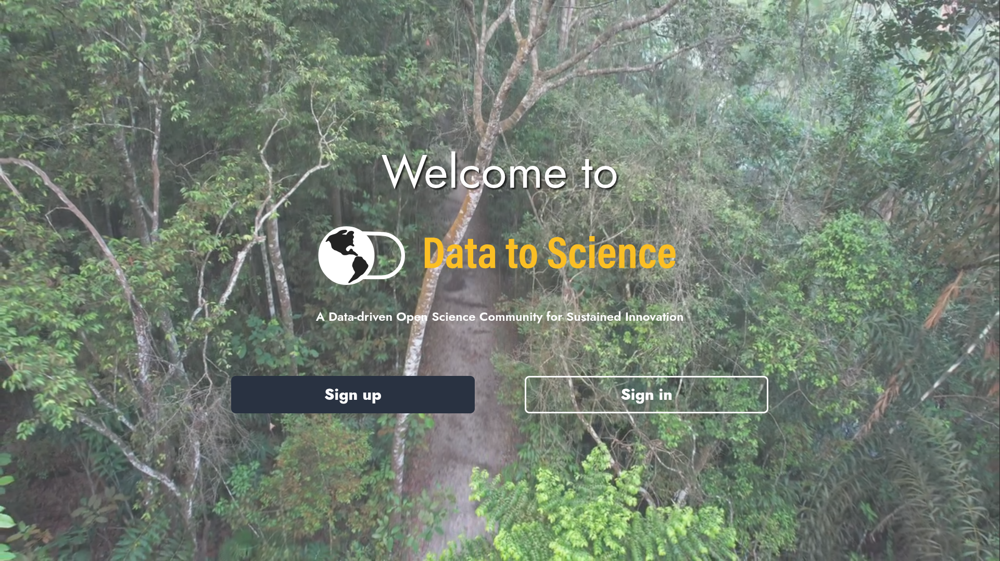
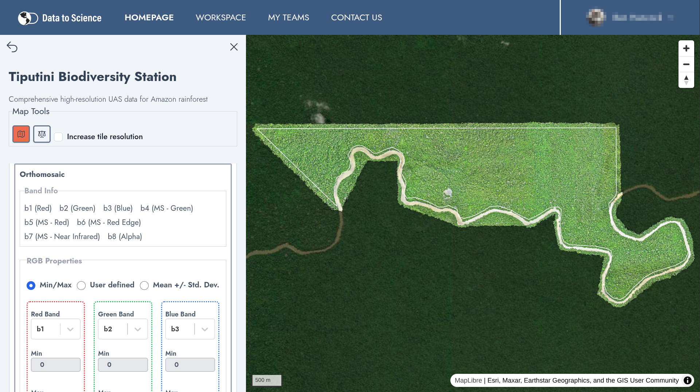
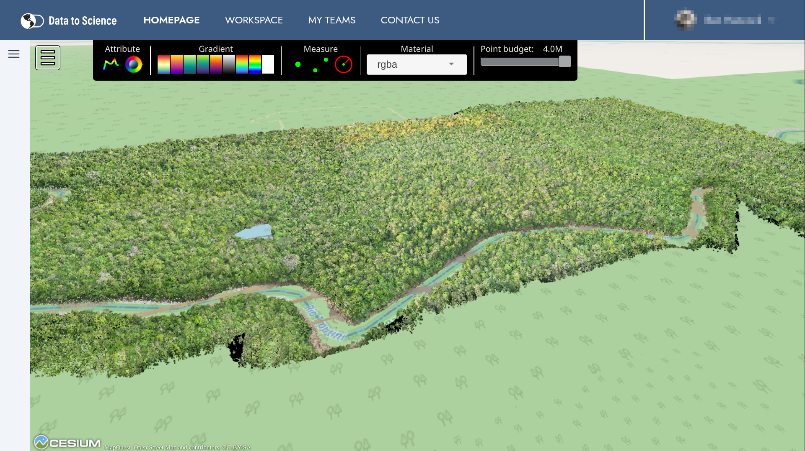
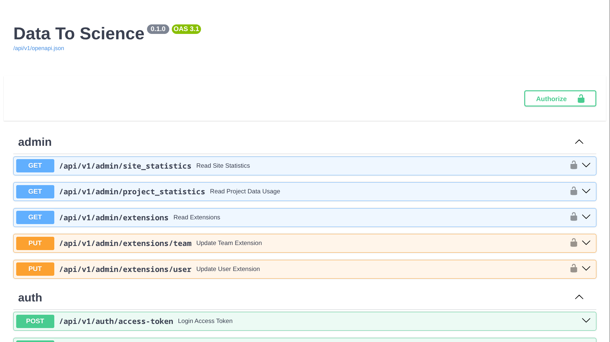

# Data to Science

<p align="center">
  
  
</p>
<p align="center">
  
  
</p>

## Table of Contents

- [What is D2S?](#what-is-d2s)
- [What Makes D2S Unique?](#what-makes-d2s-unique)
- [What Can You Do with D2S?](#what-can-you-do-with-d2s)
- [Deploying D2S](#-deploying-d2s)
  - [Quick Start](#-quick-start)
  - [Local Development](#-local-development)
- [Example Deployment](#example-deployment)
- [Documentation](#-documentation)

## What is D2S?

The Data to Science (D2S) platform is an innovative, open-source initiative designed to facilitate data sharing and collaboration among researchers worldwide. Developed by Jinha Jung, an associate professor of civil engineering at Purdue University, and his team, the platform primarily focuses on housing data from unmanned aerial vehicles (UAVs) used in agricultural and forestry research.

D2S aims to create a data-driven open science community that promotes sustained innovation. Researchers can upload, manage, and share their UAV data, making it accessible to a broader audience. This collaborative approach helps in advancing research by providing a centralized repository of valuable datasets from various projects worldwide. The platform is open-source, allowing anyone to deploy it in their own environment, ensuring flexibility and adaptability to different research needs.

## What Makes D2S Unique?

The Data to Science (D2S) platform stands out from other data-sharing platforms due to several unique features and approaches:

1. **Specialization in UAV Data:** Unlike many general data-sharing platforms, D2S is specifically designed to manage and share data from unmanned aerial vehicles (UAVs), making it particularly valuable for agricultural and forestry research.
2. **Open-Source and Free Access:** D2S is an open-source platform, ensuring that researchers worldwide can access and contribute to the data repository without any cost barriers.
3. **Focus on Collaboration:** The platform emphasizes building a community of researchers who can collaborate and share insights, fostering a more interactive and cooperative research environment.
4. **Alignment with Open Science Mandates:** D2S aligns with the White House Office of Technology and Policy mandates on openness in scientific enterprise, ensuring that federally funded research and supporting data are disclosed to the public at no cost.
5. **User-Centric Development:** The platform is developed with input from its users, ensuring that the tools and features meet the specific needs of the research community. This user-driven approach helps in creating a more effective and user-friendly platform.
6. **Training and Support:** D2S offers training workshops and support to help researchers get acquainted with the platform's tools and capabilities, ensuring they can make the most of its features.
7. **Self-Deployment Capability:** D2S can be deployed in any environment that supports Docker, providing researchers with the flexibility to integrate the platform into their existing infrastructure. This capability ensures that the platform can be customized and scaled according to specific research requirements.

These aspects make D2S a powerful tool for researchers looking to manage, share, and collaborate on UAV data, particularly in the fields of agriculture and forestry.

## What Can You Do with D2S?

The examples below illustrate common ways D2S can be used in practice, including sharing data, creating maps, and collaborating within projects.

D2S is an open-source platform that can be deployed by any organization or individual. In addition, we operate a publicly accessible D2S instance at https://ps2.d2s.org with open registration. This public instance is the recommended way to explore the platform, try example workflows, and use D2S without deploying your own infrastructure. Users who wish to run D2S in their own environment can deploy a separate instance as needed.

### Share data with project members or make it public

D2S provides two options for sharing data: **restricted** and **public**. The default designation for all uploaded data is **restricted**. Under this designation, the data is only accessible to members of the associated project. All project members must have accounts on the D2S instance.

Alternatively, data can be set to **public**, making it accessible to anyone with no account or API key required.

Data can be shared directly via a link to the underlying asset (e.g., `.tif`, `.copc.laz`) or through user-created maps. Below are example share links to **public** data hosted on the https://ps2.d2s.org D2S deployment that can be accessed without an account.

- Tiputini Biodiversity Station – Orthomosaic: https://ps2.d2s.org/sl/Lz45XWXJLcs
- Tiputini Biodiversity Station – DSM: https://ps2.d2s.org/sl/Ud904k7lgrg
- Tiputini Biodiversity Station – Point Cloud: https://ps2.d2s.org/sharepotree?file_id=2cfdd1f2-e73f-4b64-a266-d0171e119977
- Demonstration – Orthomosaic (direct file access): https://ps2.d2s.org/static/projects/afc5005d-4977-4bdd-a53a-96a3f051d312/flights/32607eae-0cd9-4c06-b4d1-a4837d237ce1/data_products/0e4c3bc2-00da-41b3-bf79-d1d1f83e4194/bb62658b-a250-46e2-8e93-081828880634.tif

### Learn more

Additional documentation and tutorials are available for users who want to explore D2S in more detail.

- **User manual:** https://docs.gdsl.org/data-to-science-user-manual
- **Website and tutorial videos:** https://d2s.org

## 🚀 Deploying D2S

D2S offers two paths for deployment:

- **Quick Start** — Uses prebuilt images and the `d2s_admin` CLI to get a running instance with minimal setup. Best for trying out the platform.
- **Local Development** — Builds from source with full environment configuration. Best for contributors and custom deployments.

### ⚡ Quick Start

#### 📋 Prerequisites

- [Python 3](https://www.python.org/) (standard library only — no additional packages required)
- [Docker Engine](https://docs.docker.com/engine/install/) and [Docker Compose](https://docs.docker.com/compose/install/)

If you can successfully run `python3 --version`, `docker --version`, and `docker compose --version` from a terminal then you are ready to proceed.

#### Initialize and start

From the root directory of the repository, run the following commands to set up and start the quickstart deployment:

```
python3 -m d2s_admin quickstart init
python3 -m d2s_admin quickstart up
```

The `init` command copies the example environment files and creates the `tusd-data/` upload directory. The `up` command starts all service containers in the background.

#### 👤 Create a superuser

Once the containers are running, create an admin account:

```
python3 -m d2s_admin createsuperuser
```

You will be prompted for an email, first name, last name, and password. You can also pass these as flags:

```
python3 -m d2s_admin createsuperuser --email admin@example.com --first-name Admin --last-name User --password yourpassword
```

#### ⏹️ Stop the containers

```
python3 -m d2s_admin quickstart down
```

<details>
<summary>Manual setup (without d2s_admin)</summary>

If you prefer to set up manually instead of using `d2s_admin`:

1. Copy the example environment files:
   ```
   cp backend.example.env backend.env
   cp db.example.env db.env
   cp frontend.example.env frontend.env
   ```
2. Create the upload directory:
   ```
   mkdir tusd-data
   ```
3. Start the containers:
   ```
   docker compose -f docker-compose.quickstart.yml up -d
   ```
4. Stop the containers:
   ```
   docker compose -f docker-compose.quickstart.yml stop
   ```

</details>

#### 🌍 Accessing the web application

The Data To Science web application can be accessed from `http://localhost:8000`. It may take up to a minute for the backend to finish initializing. If you are running D2S on a virtual machine or remote server and accessing it via a LAN IP over HTTP, update `HTTP_COOKIE_SECURE` in your `backend.env` file to:

```env
HTTP_COOKIE_SECURE=0
```

This allows cookies to work correctly in non-localhost HTTP environments.

### 🛠️ Local Development

For building from source, configuring environment variables, running tests, and working with database migrations, see the [Local Development Guide](docs/local_development.md).

# Example Deployment

An example deployment of the Data to Science platform is available at https://ps2.d2s.org. This publicly accessible instance is managed by the Geospatial Data Science Lab at Purdue University and is open for use and exploration.

While this instance provides a convenient way to try D2S, the platform is designed to be self-deployable, allowing researchers and organizations to host their own instances tailored to their specific needs.

# 📘 Documentation

For detailed documentation, visit [documentation here](docs/README.md).
