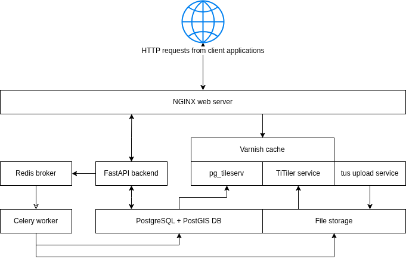

# Data-to-Science Architecture Summary

D2S uses a Python backend built with FastAPI, a lightweight web framework that adheres to modern standards for building APIs. The API serves as a central interface between client applications and a PostgreSQL database with the PostGIS extension, which manages the core application data and references to user-contributed datasets stored on the local file system. For long-running tasks initiated by client applications, D2S uses Redis as a message broker to enqueue tasks for Celery workers. When a worker becomes available, it executes the task asynchronously in the background. Task progress is tracked in the database and relayed to the clients by polling for updates. An example task is converting an uploaded GeoTIFF into a Cloud Optimized GeoTIFF (COG). After the file is received by the upload service and moved to file storage, the FastAPI application dispatches an asynchronous task to perform the conversion. A Celery worker handles the task in a background process, updating the file’s database record, and transferring the resulting COG to its final storage location.

Uploaded raster and point cloud data are stored in cloud-native formats to support efficient HTTP range requests, allowing clients to stream only the necessary portions. Raster data in Cloud Optimized GeoTIFF (COG) format is rendered as map tiles by a TiTiler service. Point cloud data is stored in the Cloud Optimized Point Cloud (COPC) format and visualized in an interactive 3D space using Potree, a WebGL-based viewer. Vector data is stored in PostgreSQL with PostGIS and served as Mapbox Vector Tiles (MVT) via the pg_tileserv service. All tile requests, raster or vector, are routed through a Varnish caching layer, which improves performance by serving cached responses and reducing backend load.

Access to user data is restricted through project-level role-based access control managed within the platform. All client requests for user data pass through authorization checks, and access to map tiles is granted through signed URLs that are time-limited and restricted to specific resources.

The D2S frontend web application is written in TypeScript using the React library and managed with Vite. The user interface and interaction design were developed in collaboration with a dedicated UI/UX team, guided by insights from user interviews. Styling is primarily handled with Tailwind CSS, a utility-first framework that enables highly customizable and consistent design. The design efforts focused on creating an intuitive interface tailored for geospatial researchers, enabling side-by-side view comparisons and supporting analytic workflows through user-centered navigation and clarity of visual feedback. The application uses React Router for navigation and organizes API communication through a centralized Axios-based module. Shared state is managed using React Context via the useContext hook. The central map interface for visualizing and interacting with user data is built with MapLibre GL JS, a TypeScript-based library that provides WebGL-powered map rendering.

<figure>
  
  <figcaption>Figure 1: System Overview Diagram</figcaption>
</figure>
