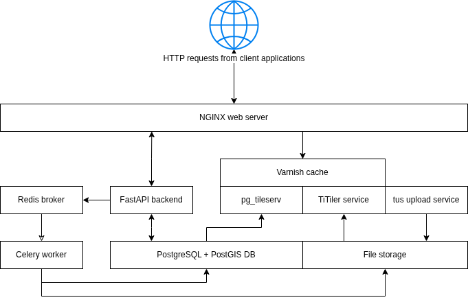

# Architecture

This page describes the overall architecture of D2S — the services involved, how they interact, and the rationale behind key technology choices.

*Figure 1: System overview diagram showing the major services and data flows.*

## Request routing (NGINX)

All HTTP requests from client applications are received by an [NGINX](https://nginx.org/) reverse proxy. NGINX routes requests to the appropriate upstream service: the FastAPI backend for API calls, the Varnish cache for tile requests, or the tusd service for file uploads.

## Backend

D2S uses a Python backend built with [FastAPI](https://fastapi.tiangolo.com/), a lightweight web framework that adheres to modern standards for building APIs. The API serves as a central interface between client applications and a [PostgreSQL](https://www.postgresql.org/) database with the [PostGIS](https://postgis.net/) extension, which manages the core application data and references to user-contributed datasets stored on the local file system.

## Asynchronous task processing

For long-running tasks initiated by client applications, D2S uses [Redis](https://redis.io/) as a message broker to enqueue tasks for [Celery](https://docs.celeryq.dev/) workers. When a worker becomes available, it executes the task asynchronously in the background. Task progress is tracked in the database and relayed to the clients by polling for updates.

An example task is converting an uploaded GeoTIFF into a Cloud Optimized GeoTIFF (COG). After the file is received by the upload service and moved to file storage, the FastAPI application dispatches an asynchronous task to perform the conversion. A Celery worker handles the task in a background process, updating the file's database record, and transferring the resulting COG to its final storage location.

## Data storage and serving

Uploaded raster and point cloud data are stored in cloud-native formats to support efficient HTTP range requests, allowing clients to stream only the necessary portions:

- **Raster data** is stored in Cloud Optimized GeoTIFF (COG) format and rendered as map tiles by a [TiTiler](https://developmentseed.org/titiler/) service.
- **Point cloud data** is stored in Cloud Optimized Point Cloud (COPC) format and visualized in an interactive 3D space using [Potree](https://potree.github.io/), a WebGL-based viewer.
- **Vector data** is stored in PostgreSQL with PostGIS and served as Mapbox Vector Tiles (MVT) via the [pg_tileserv](https://github.com/CrunchyData/pg_tileserv) service.

All tile requests — raster or vector — are routed through a [Varnish](https://varnish-cache.org/) caching layer, which improves performance by serving cached responses and reducing backend load.

## File uploads (tusd)

D2S uses [tusd](https://tus.io/) for resumable file uploads. Large files such as orthomosaics and point clouds can be uploaded reliably over unstable connections. Once an upload completes, tusd notifies the FastAPI backend via a webhook, which then dispatches a Celery task to process the file. See [Data Pipeline](data-pipeline.md) for details on the processing flow.

## Access control

Access to user data is restricted through project-level role-based access control managed within the platform. All client requests for user data pass through authorization checks, and access to map tiles is granted through signed URLs that are time-limited and restricted to specific resources. See [Authentication and Authorization](authentication.md) for details.

## Frontend

The D2S frontend web application is written in TypeScript using [React](https://react.dev/) and managed with [Vite](https://vite.dev/). Styling is handled with [Tailwind CSS](https://tailwindcss.com/). The application uses [React Router](https://reactrouter.com/) for navigation and organizes API communication through a centralized Axios-based module. Shared state is managed using React Context. The central map interface is built with [MapLibre GL JS](https://maplibre.org/), which provides WebGL-powered map rendering.

## Technology stack summary

| Component | Technology |
|-----------|------------|
| Backend framework | FastAPI (Python) |
| Database | PostgreSQL + PostGIS |
| Async tasks | Celery + Redis |
| Raster tiles | TiTiler |
| Vector tiles | pg_tileserv |
| Point clouds | Potree (WebGL) |
| Tile caching | Varnish |
| File uploads | tusd (resumable uploads) |
| Frontend | React + TypeScript + Vite |
| Styling | Tailwind CSS |
| Maps | MapLibre GL JS |
| Observability | OpenTelemetry (optional) |
