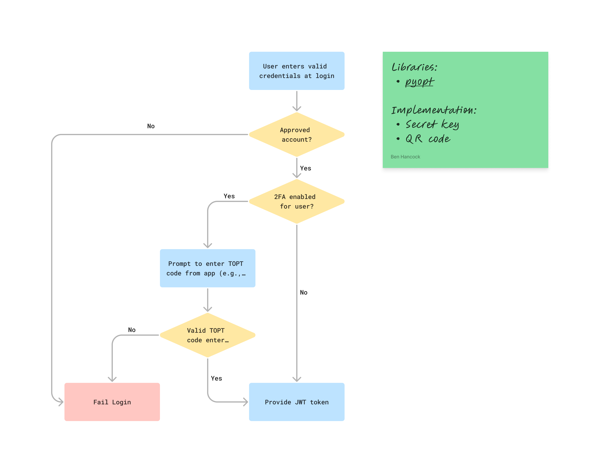

# Application security
## Password hashing and authentication
Library: `passlib[bcrypt]`

When a user creates an account, the **bcrypt** hashing algorithm is used to generate a password hash from the plain text password. The password hash and other registration inputs are stored in the `users` table in the database. The plain text password is only used to generate the hash and it is **not** stored in the database.

The creation of the bcrypt password hash is handled entirely by the `passlib[bcrypt]` library. 

Example:
```python
from passlib.context import CryptContext

pwd_context = CryptContext(
    schemes=["bcrypt"],
    deprecated="auto",
)

hashed_password = pwd_context.hash("plain-text-password")

# later when needing to verify a password during a login
verified_user = pwd_context.verify(plain_password, hashed_password)
```

In the above example, a `CryptContext` instance is created with the bcrypt hashing algorithm set as its scheme and the deprecated parameter is set to `auto`. The `auto` value indicates all hashing schemes other than bcrypt should be considered deprecated. The `hash` method is passed the plain text password and it returns a bcrypt hash.

To verify an existing user during the login, the `verify` method is passed the plain text password provided by the user and the hashed password stored in the database. If there is a match, `verify` returns `True`, and if there is no match it will return `False`.

## Authorization
Library: `python-jose[cryptography]`

JSON Web Tokens, or JWTs, are used for authorization. After a user has been authenticated for the first time, the user will be issued a JWT token. The token will be included in requests made by the user. Every JWT token will have an expiration and include information that can be used ot identify the user on the backend. Once the token has expired, the user will have to login in again to receive a new one. The current expiration is 8 days.

The JWT tokens are not secret meaning anyone with access to the token will have full view its contents. The tokens are signed before being issued. When a token is received from a user, the signature will be used to verify the token has not been altered by the user or a third party. A secret key and the HS256 hashing algorithm are used to to sign the JWT token. The creation and verification of JWT tokens is all handled by the `python-jose` library.

Example:
```python
from datetime import datetime, timedelta

from jose import jwt

ALGORITHM = "HS256"
# EXAMPLE KEY -- DO NOT USE!!!
SECRET_KEY = "3c8b3839f3c2bf3815e1c9bfe866bd673426ff684cc0f5bd6ec83f6f7f81d8dd"

# JWT token creation
# subject is the content to be included in the token
expire = datetime.utcnow() + timedelta(minutes=60 * 24 * 7)  # 7 days
to_encode = {"exp": expire, "sub": str(subject)}
encoded_jwt = jwt.encode(to_encode, SECRET_KEY, algorithm=ALGORITHM)
```

## Time-based one-time password (TOPT) implementation
Library: `pyopt`

The below flowchart outlines the plan for implementing time-based one-time password (TOPT) for users interested in two factor authentication (2FA). Users that choose to opt in to 2FA will be required to provide a TOPT code when logging in with their account credentials.

